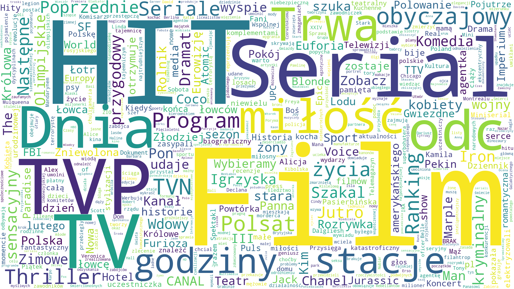

## info

script for making wordclouds from websites content

## requirements

 - `pip install requests beautifulsoup4 lxml matplotlib nltk wordcloud`
 - copy script file and stopwords directory to your local environment
 
## usage

 - specify website in url variable, inside script file
 - specify output filename in wordcloud_file variable
 - change stopwords inside script or replace files in related directory if needed (for now it handles polish words)
 - run script and wait for image file to be saved

## example

## todo

 - it could be made using parameters (for script and functions)
 - however is it needed for now?
